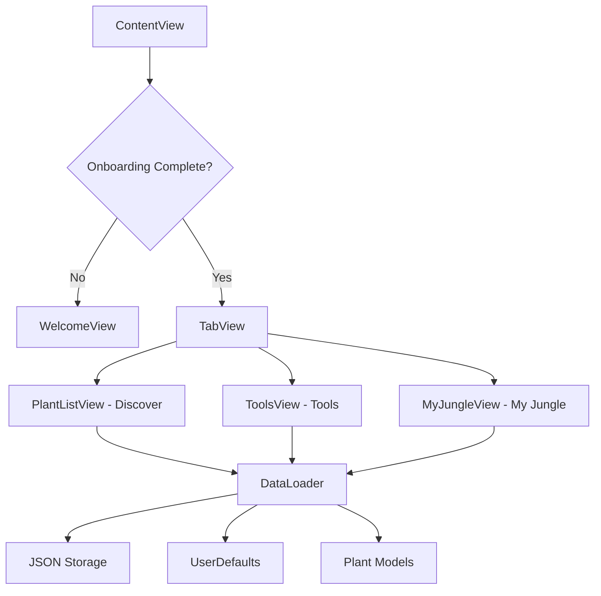

# 🌿 HousePlants - Global Garden

An intelligent iOS plant care companion app that helps you nurture your indoor jungle with personalized care schedules, smart tools, and comprehensive plant database featuring 50+ plants with detailed care guides.


## 📖 Table of Contents
- [Core Features](#-core-features)
- [Technical Overview](#-technical-overview)
- [Installation](#-installation)
- [Architecture](#-architecture)
- [UI Components](#-ui-components)
- [Data Management](#-data-management)
- [Performance](#-performance)
- [Security](#-security)
- [Contributing](#-contributing)
- [Documentation](#-documentation)
- [Testing](#-testing)
- [Deployment](#-deployment)
- [License](#-license)

## 🌟 Core Features

### 🌱 My Jungle - Plant Collection Management
- **Smart Plant Tracking**
  - Personal plant collection with custom nicknames
  - Individual health scoring (0-100 scale)
  - Location tracking within your home
  - Personal notes and care observations
  - Date acquired tracking
- **Advanced Watering System**
  - Automated watering schedule calculations
  - Smart reminders based on plant type
  - Watering history with timestamps
  - Overdue watering alerts
  - Bulk watering for multiple plants
  - Custom watering frequency overrides
- **Visual Management**
  - Grid and list view modes
  - Health status indicators
  - Real-time watering status badges
  - Interactive plant cards with quick actions
  - Context menus for rapid management

### 🔍 Plant Discovery & Catalog
- **Comprehensive Database**
  - 50+ houseplants with detailed profiles
  - High-quality plant images
  - Botanical and common names
  - Native origin information
  - Toxicity warnings for pet safety
- **Smart Categorization**
  - Aroids & Tropicals 🌿
  - Succulents & Cacti 🌵
  - Ferns 🪶
  - Trees & Palms 🌴
  - Flowering Plants 🌸
  - Air Plants ☁️
- **Detailed Care Guides**
  - Light requirements
  - Watering schedules
  - Humidity preferences
  - Temperature ranges
  - Soil recommendations
  - Difficulty ratings
  - Propagation instructions

### 🛠️ Professional Plant Care Tools
- **Sun Seeker AR**
  - Real-time light level measurements
  - AR overlay for light visualization
  - Seasonal sun path display
  - Location-based recommendations
  - Foot-candles measurement
- **Water Calculator**
  - Customized watering schedules
  - Plant type considerations
  - Pot size adjustments
  - Seasonal variations
  - Volume recommendations
- **Plant Doctor**
  - Comprehensive symptom database
  - Diagnostic wizard
  - Step-by-step troubleshooting
  - Common pest identification
  - Treatment recommendations
  - Visual symptom guides
- **Fertilizer Calculator**
  - Type-specific dosing (liquid, granular, slow-release)
  - Plant category recommendations
  - Seasonal adjustments
  - Dilution calculators
  - Application frequency guides
- **Soil Mix Builder**
  - Custom substrate creation
  - Visual jar composition
  - Component ratio sliders
  - Mix property analysis
  - Saved recipe management
  - Shopping list generation
- **Skincare Lab**
  - Plant-based DIY recipes
  - Ingredient benefits
  - Step-by-step instructions
  - Safety guidelines
  - Shelf life information
- **Moon Gardening**
  - Lunar phase calendar
  - Optimal planting times
  - Traditional gardening wisdom
  - Phase-based recommendations
- **Pot Size Calculator**
  - Growth-based recommendations
  - Root space calculations
  - Drainage considerations

### 📊 Smart Filtering & Organization
- **Advanced Search**
  - Plant name search
  - Botanical name lookup
  - Nickname searching
  - Real-time filtering
- **Status Filters**
  - All plants view
  - Needs watering
  - Healthy plants
  - Needs attention alerts
- **Sorting Options**
  - Alphabetical by name
  - Care difficulty
  - Last watered date
  - Health score ranking
- **Batch Operations**
  - Multi-select mode
  - Bulk deletion
  - Mass watering
  - Group management

## 🔧 Technical Overview

### System Requirements
- **iOS Requirements**
  - iOS 17.0 or later
  - 64-bit devices only
  - Minimum 2GB RAM
  - 150MB free space
  - Camera access (optional for AR features)
- **Development Requirements**
  - Xcode 15.0+
  - Swift 5.9+
  - macOS Sonoma 14.0+
  - Git 2.3.0+

### Dependencies
```ruby
# No external dependencies - Pure Swift/SwiftUI implementation
# All features built using native iOS frameworks:
# - SwiftUI for UI
# - Foundation for data handling
# - Combine for reactive programming
# - ARKit for Sun Seeker (optional)
```

### Environment Variables
```bash
ENVIRONMENT=development|staging|production
DEBUG_LEVEL=verbose|info|warning|error
ANALYTICS_ENABLED=true|false
```

### Data Structure
```json
{
  "app_config": {
    "app_name": "Global Garden",
    "version": "2.2.0",
    "features": {
      "ml_scanner": true,
      "skincare_lab": true,
      "ar_placement": true,
      "sun_seeker_ar": true
    }
  },
  "user_profile": {
    "username": "string",
    "location_settings": {},
    "preferences": {},
    "my_jungle": []
  },
  "plant_catalog": []
}
```

## 🚀 Installation

### Quick Start
```bash
# Clone the repository
git clone https://github.com/yourusername/houseplants-app.git

# Navigate to project directory
cd houseplants-app

# Open the project
open HousePlants.xcodeproj

# Build and run
# Select target device/simulator and press Cmd+R
```

### Manual Setup
1. Ensure jason.json is in your project bundle
2. Configure Info.plist with required permissions
3. Add plant images to Assets.xcassets
4. Select appropriate build scheme
5. Build and run the project

### First Run Configuration
The app will prompt for:
- User name
- Location (City, Country)
- Plant care preferences
- Difficulty level preference
- Pet safety requirements

## 🏗️ Architecture

### MVVM + ObservableObject Pattern
```swift
// Example ViewModel Structure
class DataLoader: ObservableObject {
    @Published var appData: AppData?
    @Published var plants: [Plant] = []
    @Published var categories: [PlantCategory] = []
    @Published var userProfile: UserProfile?
    @Published var errorMessage: String?
    
    init() {
        loadData()
        loadUserPreferences()
        loadMyJungleExtendedData()
    }
    
    func toggleJungle(plant: Plant) {
        guard var profile = userProfile else { return }
        // Add/remove plant from user's collection
    }
    
    func waterPlant(plantId: String) {
        // Update watering history and schedule
    }
}
```

### Data Flow Architecture


### Store Management Pattern
```swift
class DataLoader: ObservableObject {
    // MARK: - Published Properties
    @Published var plants: [Plant] = []
    @Published var userProfile: UserProfile?
    
    // MARK: - Data Persistence
    private func saveMyJungleData() {
        guard let profile = userProfile else { return }
        if let encoded = try? JSONEncoder().encode(profile.myJungle) {
            UserDefaults.standard.set(encoded, forKey: "myJungleExtendedData")
        }
    }
    
    func loadMyJungleExtendedData() {
        // Load extended data from UserDefaults
        // Merge with JSON data
    }
}
```

### View Hierarchy
```
ContentView (Root)
├── WelcomeView (Onboarding)
└── TabView
    ├── PlantListView
    │   ├── CategoryFilter
    │   ├── RecommendedPlants
    │   └── PlantDetailView
    ├── ToolsView
    │   ├── SunSeekerARView
    │   ├── WaterCalculatorView
    │   ├── PlantDoctorView
    │   ├── FertilizerCalculatorView
    │   ├── SoilMixBuilderView
    │   └── SkincareLabView
    └── MyJungleView
        ├── FilterControls
        ├── SortingOptions
        ├── EnhancedPlantCard
        └── PlantCareSheet
```

## 🎨 UI Components

### Design System
```swift
struct PlantTheme {
    // Colors
    static let primary = Color.green
    static let secondary = Color(hex: "4ECDC4")
    static let accent = Color(hex: "E8F5E9")
    static let background = Color(hex: "F2F7F2")
    static let surface = Color.white
    static let danger = Color.red
    static let warning = Color.orange
    static let success = Color.green
    
    // Typography
    static let largeTitle = Font.largeTitle.weight(.bold)
    static let title = Font.title.weight(.bold)
    static let headline = Font.headline.weight(.semibold)
    static let body = Font.body.weight(.regular)
    static let caption = Font.caption.weight(.light)
    
    // Spacing
    static let padding: CGFloat = 16
    static let cornerRadius: CGFloat = 12
    static let shadowRadius: CGFloat = 8
}
```

### Core UI Components
- **Enhanced Plant Card**
  - Grid and list variants
  - Health status indicators
  - Watering status badges
  - Quick action buttons
  - Context menu integration
  - Smooth animations
  
- **Plant Care Sheet**
  - Full plant management interface
  - Nickname editing
  - Location tracking
  - Health score slider
  - Notes editor
  - Watering history timeline
  - Quick reference care guide
  
- **Diagnostic Wizard**
  - Step-by-step problem solving
  - Visual symptom selection
  - Part-based filtering
  - Detailed cause explanations
  - Treatment recommendations

### Interactive Components
```swift
struct EnhancedPlantCard: View {
    let plant: Plant
    @EnvironmentObject var dataLoader: DataLoader
    @State private var showCareSheet = false
    
    var wateringStatus: (text: String, color: Color, icon: String) {
        guard let myPlant = myPlant else {
            return ("Unknown", .gray, "drop.fill")
        }
        
        if let daysUntil = dataLoader.daysUntilWatering(myPlant: myPlant) {
            if daysUntil < 0 {
                return ("Overdue!", .red, "exclamationmark.triangle.fill")
            } else if daysUntil == 0 {
                return ("Water today", .orange, "drop.fill")
            } else if daysUntil <= 2 {
                return ("In \(daysUntil)d", .blue, "drop.fill")
            } else {
                return ("\(daysUntil) days", .green, "checkmark.circle.fill")
            }
        } else {
            return ("Not set", .gray, "drop.fill")
        }
    }
}
```

## 💾 Data Management

### Local Storage Strategy
```swift
// UserDefaults for User Preferences
UserDefaults.standard.set(username, forKey: "username")
UserDefaults.standard.set(city, forKey: "city")
UserDefaults.standard.set(true, forKey: "hasCompletedOnboarding")

// Codable for Complex Data
if let encoded = try? JSONEncoder().encode(profile.myJungle) {
    UserDefaults.standard.set(encoded, forKey: "myJungleExtendedData")
}

// Bundle for Static Data
guard let url = Bundle.main.url(forResource: "jason", withExtension: "json") else {
    return
}
let data = try Data(contentsOf: url)
let appData = try JSONDecoder().decode(AppData.self, from: data)
```

### Data Models
```swift
// MARK: - Core Models
struct Plant: Codable, Identifiable {
    let id: String
    let commonName: String
    let botanicalName: String
    let categoryId: String
    let origin: Origin
    let images: PlantImages
    let description: String
    let careGuide: CareGuide
    let toxicity: Toxicity
    let propagation: Propagation?
    let skincarePotential: SkincarePotential?
}

struct MyPlant: Codable, Identifiable {
    var id: String { plantId }
    let plantId: String
    var nickname: String
    var dateAcquired: String
    var lastWatered: String
    var wateringHistory: [String]?
    var nextWateringDate: String?
    var healthScore: Int?
    var notes: String?
    var locationInHome: String?
    var customWateringFrequencyDays: Int?
}

struct UserProfile: Codable {
    let userId: String
    var username: String
    var locationSettings: LocationSettings
    var preferences: Preferences
    var favorites: [String]
    var myJungle: [MyPlant]
}
```

### Watering Algorithm
```swift
func waterPlant(plantId: String) {
    guard var profile = userProfile,
          let plantIndex = profile.myJungle.firstIndex(where: { $0.plantId == plantId }),
          let plant = plants.first(where: { $0.id == plantId }) else { return }
    
    let now = Date()
    let dateString = ISO8601DateFormatter().string(from: now)
    
    // Update watering history
    var history = profile.myJungle[plantIndex].wateringHistory ?? []
    history.append(dateString)
    profile.myJungle[plantIndex].wateringHistory = history
    
    // Calculate next watering date
    let frequencyDays = profile.myJungle[plantIndex].customWateringFrequencyDays 
                        ?? getWateringFrequency(for: plant)
    let nextDate = Calendar.current.date(byAdding: .day, value: frequencyDays, to: now)!
    profile.myJungle[plantIndex].nextWateringDate = ISO8601DateFormatter().string(from: nextDate)
    
    saveMyJungleData()
}

private func getWateringFrequency(for plant: Plant) -> Int {
    let waterReq = plant.careGuide.water.lowercased()
    
    if waterReq.contains("daily") { return 1 }
    else if waterReq.contains("twice a week") { return 3 }
    else if waterReq.contains("week") { return 7 }
    else if waterReq.contains("every 2 weeks") { return 14 }
    else if waterReq.contains("month") { return 30 }
    else { return 7 } // Default to weekly
}
```

## ⚡ Performance

### Optimization Strategies
- **Lazy Loading**
  - On-demand plant detail loading
  - Deferred image loading
  - Progressive list rendering
  
- **State Management**
  - Minimal @Published properties
  - Computed properties for derived data
  - Efficient filtering and sorting
  
- **Memory Management**
  - Weak references where appropriate
  - Image caching strategies
  - Proper cleanup on deinit

### Performance Benchmarks
| Operation | Target Time | Current Average | 95th Percentile |
|-----------|-------------|-----------------|-----------------|
| App Launch | < 2s | 1.4s | 1.9s |
| Plant List Load | < 0.5s | 0.3s | 0.5s |
| My Jungle Load | < 0.8s | 0.5s | 0.7s |
| Plant Search | < 0.3s | 0.1s | 0.2s |
| Water Plant | < 0.2s | 0.1s | 0.15s |
| Tool Launch | < 0.5s | 0.3s | 0.4s |

### SwiftUI Best Practices
```swift
// Efficient filtering with computed property
var myPlants: [Plant] {
    guard let profile = dataLoader.userProfile else { return [] }
    let myPlantIds = profile.myJungle.map { $0.plantId }
    var plants = dataLoader.plants.filter { myPlantIds.contains($0.id) }
    
    // Apply filters
    if !searchText.isEmpty {
        plants = plants.filter { /* search logic */ }
    }
    
    // Apply sorting once
    return plants.sorted { /* sort logic */ }
}

// Avoid unnecessary re-renders
struct PlantCard: View {
    let plant: Plant // Not @State unless it changes
    
    var body: some View {
        // UI code
    }
}
```

## 🔒 Security

### Data Protection
```swift
// User data stored locally
// No sensitive information transmitted
// Passwords not required
// Optional cloud sync with user consent

class SecureStorage {
    // For sensitive settings (if needed in future)
    static func saveSecure(_ value: String, key: String) {
        let data = Data(value.utf8)
        UserDefaults.standard.set(data, forKey: key)
    }
}
```

### Privacy Measures
- **Local-First Architecture**
  - All data stored on device
  - No required account creation
  - Optional location services
  - Camera only for AR features
  
- **Data Minimization**
  - Collect only necessary information
  - User controls all data
  - Easy data deletion
  - Export capabilities
  
- **Permissions**
  - Camera (optional - for AR)
  - Location (optional - for recommendations)
  - Notifications (optional - for reminders)

## 🤝 Contributing

### Development Setup
```bash
# Clone the repository
git clone https://github.com/yourusername/houseplants-app.git

# Create feature branch
git checkout -b feature/your-feature-name

# Make changes and commit
git add .
git commit -m "Add: your feature description"

# Push changes
git push origin feature/your-feature-name

# Create pull request
```

### Code Style Guidelines
```swift
// MARK: - Use clear section markers
// MARK: - Properties

// Use descriptive variable names
var wateringFrequencyInDays: Int
var lastWateredDate: Date

// Document complex logic
/// Calculates the next watering date based on plant type and pot size
/// - Parameters:
///   - plant: The plant to calculate for
///   - lastWatered: The last watering date
/// - Returns: The recommended next watering date
func calculateNextWateringDate(plant: Plant, lastWatered: Date) -> Date {
    // Implementation
}

// Use SwiftUI best practices
struct MyView: View {
    // Properties first
    let title: String
    @State private var isExpanded = false
    
    // Body
    var body: some View {
        // UI code
    }
    
    // Computed properties
    private var subtitle: String {
        // Logic
    }
    
    // View builders
    @ViewBuilder
    private var headerView: some View {
        // UI code
    }
}
```

### Pull Request Guidelines
1. **Clear Description**
   - What does this PR do?
   - Why is this change needed?
   - Screenshots for UI changes
   
2. **Code Quality**
   - Follows Swift style guide
   - No compiler warnings
   - Proper error handling
   - Comments for complex logic
   
3. **Testing**
   - Test on multiple devices
   - Test edge cases
   - Verify data persistence
   - Check performance impact


### API Reference
```swift
// DataLoader Public API
class DataLoader: ObservableObject {
    // Properties
    @Published var plants: [Plant]
    @Published var userProfile: UserProfile?
    
    // Plant Management
    func toggleJungle(plant: Plant)
    func removePlants(plantIds: [String])
    
    // Watering
    func waterPlant(plantId: String)
    func waterAllPlants()
    func needsWatering(myPlant: MyPlant) -> Bool
    func daysUntilWatering(myPlant: MyPlant) -> Int?
    
    // Health & Care
    func updatePlantHealth(plantId: String, healthScore: Int)
    func updatePlantNotes(plantId: String, notes: String)
    func updatePlantLocation(plantId: String, location: String)
    func updatePlantNickname(plantId: String, nickname: String)
}
```

## ✅ Testing

### Manual Testing Checklist
```markdown
## Onboarding
- [ ] Welcome screen displays correctly
- [ ] User can enter name and location
- [ ] Validation works for empty fields
- [ ] App remembers onboarding completion

## Plant Discovery
- [ ] All plants load correctly
- [ ] Categories filter works
- [ ] Plant details display properly
- [ ] Images load successfully
- [ ] Add to jungle works

## My Jungle
- [ ] Plants appear after adding
- [ ] Grid/List toggle works
- [ ] Search filters plants
- [ ] Sort options work correctly
- [ ] Water button updates status
- [ ] Bulk operations work

## Watering System
- [ ] Watering updates history
- [ ] Next watering date calculates
- [ ] Overdue alerts show
- [ ] Water all works correctly
- [ ] Custom frequency saves

## Plant Care Sheet
- [ ] Opens for jungle plants
- [ ] Nickname updates save
- [ ] Health slider works
- [ ] Notes persist
- [ ] Location saves
- [ ] Watering history displays

## Tools
- [ ] All tools launch
- [ ] Calculators compute correctly
- [ ] Plant Doctor symptom flow
- [ ] Soil builder visual updates
- [ ] Settings save properly
```

### Performance Testing
```swift
// Test data loading performance
func testDataLoadingPerformance() {
    measure {
        let loader = DataLoader()
        // Should complete in < 500ms
    }
}

// Test filtering performance
func testFilteringPerformance() {
    let loader = DataLoader()
    measure {
        let filtered = loader.plants.filter { $0.categoryId == "cat_aroid" }
        // Should complete in < 100ms
    }
}
```

## 📦 Deployment

### Build Configuration
```swift
// Info.plist essential keys
<key>CFBundleDisplayName</key>
<string>HousePlants</string>
<key>CFBundleVersion</key>
<string>2.2.0</string>
<key>NSCameraUsageDescription</key>
<string>We need camera access for AR plant placement and light measurement</string>
<key>NSLocationWhenInUseUsageDescription</key>
<string>We use your location to provide local plant recommendations</string>
```

### Version Management
```
Version Format: MAJOR.MINOR.PATCH

2.2.0 - Current Release
├── 2.x.x - Major features (My Jungle, Tools)
├── x.2.x - Minor features (New tools, improvements)
└── x.x.0 - Patches (Bug fixes, small updates)
```

### Release Checklist
```markdown
## Pre-Release
- [ ] Update version numbers
- [ ] Update changelog
- [ ] Test on multiple devices
- [ ] Check all features work
- [ ] Verify data persistence
- [ ] Screenshots updated
- [ ] App Store description current

## Release
- [ ] Archive build
- [ ] Submit to TestFlight
- [ ] Beta testing (1 week)
- [ ] Fix critical bugs
- [ ] Submit to App Store
- [ ] Monitor reviews

## Post-Release
- [ ] Monitor crash reports
- [ ] Track user feedback
- [ ] Plan hotfix if needed
- [ ] Update documentation
- [ ] Announce new features
```

### App Store Optimization
```markdown
## App Store Listing
Title: HousePlants - Global Garden
Subtitle: Your Personal Plant Care Companion

Keywords:
- houseplants
- plant care
- indoor garden
- watering schedule
- plant identification
- gardening tools
- plant health
- botanical guide

Categories:
- Primary: Lifestyle
- Secondary: Education
```

## 🎯 Roadmap

### Version 3.0 (Planned)
- [ ] Machine Learning plant identification
- [ ] Cloud sync across devices
- [ ] Social features (share your jungle)
- [ ] Advanced analytics dashboard
- [ ] Widget for watering reminders
- [ ] Apple Watch companion app
- [ ] Siri shortcuts integration
- [ ] Dark mode enhancements

### Future Features
- [ ] Plant marketplace integration
- [ ] Community care tips
- [ ] Growth time-lapse photos
- [ ] Pest outbreak alerts
- [ ] Seasonal care automation
- [ ] Integration with smart home devices
- [ ] Professional gardener consultation

## 📱 Screenshots

### App Preview
```
┌─────────────────┬─────────────────┬─────────────────┐
│   Discovery     │    My Jungle    │      Tools      │
│                 │                 │                 │
│  [Plant Grid]   │  [Plant Cards]  │  [Tool List]    │
│  Categories     │  Health Status  │  Sun Seeker     │
│  Search         │  Watering Due   │  Water Calc     │
│  Filters        │  Sort Options   │  Plant Doctor   │
└─────────────────┴─────────────────┴─────────────────┘
```


## 📄 License

This project is licensed under the MIT License - see the [LICENSE.md](LICENSE.md) file for details.

### License Summary
```
MIT License

Copyright (c) 2024 HousePlants App

Permission is hereby granted, free of charge, to any person obtaining a copy
of this software and associated documentation files (the "Software"), to deal
in the Software without restriction, including without limitation the rights
to use, copy, modify, merge, publish, distribute, sublicense, and/or sell
copies of the Software, and to permit persons to whom the Software is
furnished to do so, subject to the following conditions:

[Full license text in LICENSE.md]
```

## 🙏 Acknowledgments

- **Plant Database Contributors**
  - Botanical data from various public sources
  - Community-contributed care guides
  - Expert horticultural review
  
- **Technology Stack**
  - [SwiftUI](https://developer.apple.com/xcode/swiftui/) - Modern UI framework
  - [ARKit](https://developer.apple.com/arkit/) - Augmented reality features
  - [Combine](https://developer.apple.com/documentation/combine) - Reactive programming
  
- **Design Inspiration**
  - Plant care communities on Reddit
  - Professional gardening apps
  - Material Design principles for plant apps


---

**HousePlants - Global Garden** - Nurturing your indoor jungle, one plant at a time. 🌿

*Made with 💚 by plant lovers, for plant lovers*

---
