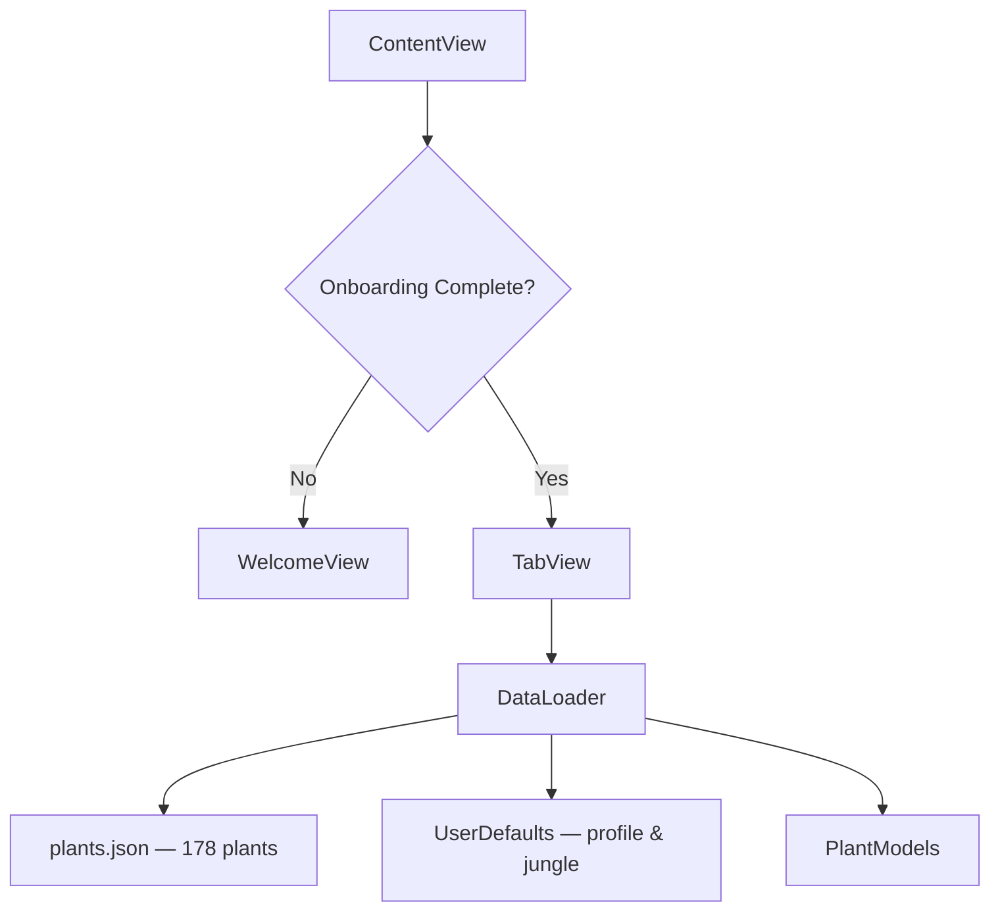

# 🌿 HousePlants - Global Garden

An intelligent iOS plant care companion that helps you nurture your indoor jungle with personalized care schedules, smart tools, streak tracking, and a comprehensive plant database featuring 178+ plants with detailed care guides.


## 📖 Table of Contents
- [Core Features](#-core-features)
- [Technical Overview](#-technical-overview)
- [Installation](#-installation)
- [Architecture](#-architecture)
- [UI Components](#-ui-components)
- [Data Management](#-data-management)
- [Performance](#-performance)
- [Security](#-security)
- [Contributing](#-contributing)
- [Testing](#-testing)
- [Deployment](#-deployment)
- [License](#-license)

## 🌟 Core Features

### 🌱 My Jungle — Plant Collection Management
- **Smart Plant Tracking**
  - Personal plant collection with custom nicknames
  - Individual health scoring (0–100 scale)
  - Location tracking within your home
  - Personal notes and care observations
  - Date acquired tracking
- **Streak System**
  - Daily care streak counter with animated flame UI
  - Milestone glow and confetti celebrations
  - Streak persisted in user profile
- **Advanced Watering System**
  - Automated watering schedule calculations
  - Smart reminders based on plant type
  - Watering history with timestamps
  - Overdue watering alerts
  - Bulk watering for multiple plants
  - Custom watering frequency overrides
- **Visual Management**
  - Grid and list view modes
  - Health status indicators
  - Real-time watering status badges
  - Interactive plant cards with quick actions
  - Context menus for rapid management

### 🔍 Plant Discovery & Catalog
- **Comprehensive Database**
  - 178+ houseplants in the main catalog (plants.json)
  - Extended reference library of 727 plants (extensive_plants.json)
  - High-quality plant images
  - Botanical and common names
  - Native origin information
  - Toxicity warnings for pet and child safety
- **Smart Categorization**
  - Aroids & Tropicals 🌿
  - Succulents & Cacti 🌵
  - Ferns 🪶
  - Trees & Palms 🌴
  - Flowering Plants 🌸
  - Air Plants ☁️
- **Detailed Care Guides**
  - Light requirements
  - Watering schedules
  - Humidity preferences
  - Temperature ranges
  - Soil recommendations
  - Difficulty ratings
  - Propagation instructions

### 🛠️ Professional Plant Care Tools

| Tool | Description |
|------|-------------|
| **Climate Matcher** | Recommends plants suited to your city/climate using GPS auto-detection or manual entry |
| **Sun Seeker AR** | Real-time light level measurement with foot-candle readings and AR overlay |
| **Water Calculator** | Customized watering schedules adjusted for pot size and season |
| **Plant Doctor** | Symptom-based diagnostic wizard with pest identification and treatment guides |
| **Fertilizer Calculator** | Type-specific dosing for liquid, granular, and slow-release fertilizers |
| **Soil Mix Builder** | Custom substrate recipes with visual jar composer and shopping list export |
| **Toxicity Checker** | Instant pet/child safety lookup across the full plant catalog |
| **Propagation Station** | Step-by-step propagation guides per plant and method |
| **Seasonal Care Calendar** | Month-by-month care adjustments for light, water, and feeding |
| **Moon Gardening** | Lunar phase calendar with planting recommendations |
| **Origin Explorer** | Interactive native-habitat explorer showing where each plant originates |
| **Skincare Lab** | Plant-based DIY recipes with ingredient benefits and shelf-life info |
| **Pot Size Calculator** | Growth-based repotting recommendations |

### 👤 Profile & Onboarding
- Multi-step onboarding collecting name, location, difficulty, and pet-safety preferences
- Avatar selection: cactus, fern, monstera, succulent
- Persistent profile stored in UserDefaults
- Settings accessible from the Profile tab

### 🔔 Notifications
- In-app notification center for watering reminders and care alerts
- Notification models decoupled from UI for easy extension

### 📊 Smart Filtering & Organization
- Real-time search by common name, botanical name, or nickname
- Status filters: All / Needs Watering / Healthy / Needs Attention
- Sort by name, difficulty, last watered, or health score
- Batch select, bulk delete, and mass watering

## 🔧 Technical Overview

### System Requirements
- **iOS** 17.0 or later, 64-bit devices
- **Development**: Xcode 15.0+, Swift 5.9+, macOS Sonoma 14.0+

### Dependencies
```
No external dependencies — pure Swift/SwiftUI
Native frameworks: SwiftUI · Foundation · Combine · CoreLocation · ARKit (optional)
```

### Data Structure
```json
{
  "app_config": {
    "app_name": "Global Garden",
    "version": "3.0.0"
  },
  "user_profile": {
    "username": "string",
    "avatar": "avatar_monstera | avatar_cactus | avatar_fern | avatar_succulent",
    "currentStreak": 0,
    "location_settings": {},
    "preferences": {},
    "my_jungle": []
  },
  "plant_catalog": []
}
```

## 🚀 Installation

```bash
git clone https://github.com/aryansk/HousePlants.io.git
cd HousePlants.io
open HousePlants.xcodeproj
# Select a simulator or device, then Cmd+R
```

### First-Run Configuration
The onboarding wizard will ask for:
- Display name and avatar
- City and country (or tap **Auto-detect** for GPS)
- Care difficulty preference
- Pet-safety filter preference

## 🏗️ Architecture

### MVVM + ObservableObject
```
ContentView (Root)
├── WelcomeView          ← multi-step onboarding
└── TabView
    ├── PlantListView    ← Discover tab
    │   ├── CategoryFilter
    │   ├── RecommendedPlants
    │   └── PlantDetailView
    ├── ToolsView        ← Tools tab (13 tools)
    │   ├── ClimateMatcherToolView
    │   ├── SunSeekerARView
    │   ├── WaterCalculatorView
    │   ├── PlantDoctorView
    │   ├── FertilizerCalculatorView
    │   ├── SoilMixBuilderView
    │   ├── ToxicityCheckerView
    │   ├── PropagationStationView
    │   ├── SeasonalCareCalendarView
    │   ├── CelestialMoonPhaseView
    │   ├── OriginExplorerView
    │   ├── SkincareLabView
    │   └── PotSizeCalculatorView
    ├── MyJungleView     ← My Jungle tab
    │   ├── FilterControls
    │   ├── SortingOptions
    │   ├── JungleCardComponents
    │   ├── PlantCareSheet
    │   └── StreakView
    └── ProfileView      ← Profile tab
```

### Data Flow

```mermaid
graph TD
    A[ContentView] --> B{Onboarding Complete?}
    B -->|No| C[WelcomeView]
    B -->|Yes| D[TabView]
    D --> E[DataLoader]
    E --> F[plants.json — 178 plants]
    E --> G[UserDefaults — profile & jungle]
    E --> H[PlantModels]
```

### Key Services
```swift
class DataLoader: ObservableObject {
    @Published var plants: [Plant] = []
    @Published var userProfile: UserProfile?

    func toggleJungle(plant: Plant)
    func waterPlant(plantId: String)
    func waterAllPlants()
    func needsWatering(myPlant: MyPlant) -> Bool
    func daysUntilWatering(myPlant: MyPlant) -> Int?
    func updatePlantHealth(plantId: String, healthScore: Int)
    func updatePlantNotes(plantId: String, notes: String)
    func updatePlantNickname(plantId: String, nickname: String)
    func updatePlantLocation(plantId: String, location: String)
}

class HapticManager {            // singleton, respects user toggle
    static let shared: HapticManager
    func playImpact(style: UIImpactFeedbackGenerator.FeedbackStyle)
    func playNotification(type: UINotificationFeedbackGenerator.FeedbackType)
}

class LocationManager: ObservableObject {   // CoreLocation wrapper
    @Published var cityName: String?
    @Published var countryName: String?
    @Published var isUpdating: Bool
    func requestLocation()
}
```

## 🎨 UI Components

The app uses the **Claude design system** (defined in `UIStyles.swift` and `UIComponents.swift`):

```swift
// Colors
Color.claudeBackground      // off-white app background
Color.claudeAccent          // primary action color
Color.claudeSecondaryText   // muted labels

// Typography helper
Font.claudeSans(size:weight:)

// Shared components
ClaudeHeader(title:subtitle:showBackButton:)
```

### Core Components
- **JungleCardComponents** — grid and list plant cards with health + watering badges
- **PlantCareSheet** — full plant management sheet (nickname, health slider, notes, location, watering history)
- **StreakView** — animated flame with pulse, glow, and confetti for care streaks
- **PlantDoctorView** — multi-step diagnostic wizard with symptom → cause → treatment flow
- **ClimateMatcherToolView** — location-aware plant recommendation engine

## 💾 Data Management

### Storage Strategy
| Data | Storage |
|------|---------|
| Static plant catalog | `plants.json` (bundle) |
| Extended plant reference | `extensive_plants.json` (bundle) |
| User profile & preferences | `UserDefaults` |
| My Jungle plant states | `UserDefaults` (Codable JSON) |

### Core Models
```swift
struct Plant: Codable, Identifiable {
    let id: String
    let commonName: String
    let botanicalName: String
    let categoryId: String
    let careGuide: CareGuide
    let toxicity: Toxicity
    let propagation: Propagation?
    let skincarePotential: SkincarePotential?
}

struct MyPlant: Codable, Identifiable {
    let plantId: String
    var nickname: String
    var lastWatered: String
    var wateringHistory: [String]?
    var nextWateringDate: String?
    var healthScore: Int?
    var notes: String?
    var locationInHome: String?
    var customWateringFrequencyDays: Int?
}

struct UserProfile: Codable {
    var username: String
    var avatar: String
    var currentStreak: Int
    var locationSettings: LocationSettings
    var preferences: Preferences
    var myJungle: [MyPlant]
}
```

## ⚡ Performance

- Lazy list rendering — only visible cards are evaluated
- Filtering and sorting use computed properties to avoid redundant work
- `HapticManager` pre-calls `.prepare()` to reduce haptic latency
- No external network calls — fully offline-capable

## 🔒 Security & Privacy

- **Local-first**: all data lives on device, no account required
- **Permissions requested only when needed**:
  - Location — Climate Matcher auto-detect (optional)
  - Camera — Sun Seeker AR (optional)
  - Notifications — watering reminders (optional)
- No analytics, no tracking, no data transmission

## 🤝 Contributing

```bash
git clone https://github.com/aryansk/HousePlants.io.git
git checkout -b feature/your-feature
# make changes
git commit -m "feat: description"
git push origin feature/your-feature
# open a PR against main
```

### Guidelines
- Follow Swift API design guidelines
- No external dependencies without discussion
- Test on at least one physical device for haptic and location features
- UI changes should include before/after screenshots in the PR

## ✅ Testing Checklist

```
Onboarding
  [ ] All avatar options display correctly
  [ ] Auto-detect location populates city/country
  [ ] Preferences persist across app restarts

Plant Discovery
  [ ] 178+ plants load and categories filter correctly
  [ ] Plant details, images, and toxicity info display

My Jungle
  [ ] Add / remove plants
  [ ] Grid ↔ List toggle
  [ ] Search, filter, sort
  [ ] Water button updates schedule and history
  [ ] Streak increments on daily care action
  [ ] Bulk watering

Tools
  [ ] Climate Matcher returns relevant results
  [ ] Sun Seeker launches and reads light levels
  [ ] Plant Doctor completes full symptom flow
  [ ] Toxicity Checker returns correct safety status
  [ ] All 13 tools launch without crash

Haptics
  [ ] Haptic toggle in settings enables/disables feedback
```

## 📦 Deployment

### Version
```
3.0.0 — current
```

### Build
```bash
# Archive in Xcode: Product → Archive
# Distribute via TestFlight or App Store Connect
```

### Info.plist Keys
```xml
<key>NSLocationWhenInUseUsageDescription</key>
<string>Used to auto-detect your city for the Climate Matcher tool.</string>
<key>NSCameraUsageDescription</key>
<string>Used for the Sun Seeker AR light measurement feature.</string>
```

## 🎯 Roadmap

- [ ] iCloud sync for My Jungle across devices
- [ ] Home Screen widget for today's watering tasks
- [ ] ML-based plant identification from photo
- [ ] Apple Watch companion for watering reminders
- [ ] Social jungle sharing
- [ ] Siri shortcuts integration
- [ ] Dark mode polish

## 📄 License

MIT License — see [LICENSE.md](LICENSE.md) for details.

## 🙏 Acknowledgments

- SwiftUI, ARKit, CoreLocation, Combine — Apple native frameworks
- Botanical data compiled from public horticultural sources

---

**HousePlants - Global Garden** — Nurturing your indoor jungle, one plant at a time. 🌿

*Made with 💚 by plant lovers, for plant lovers*
